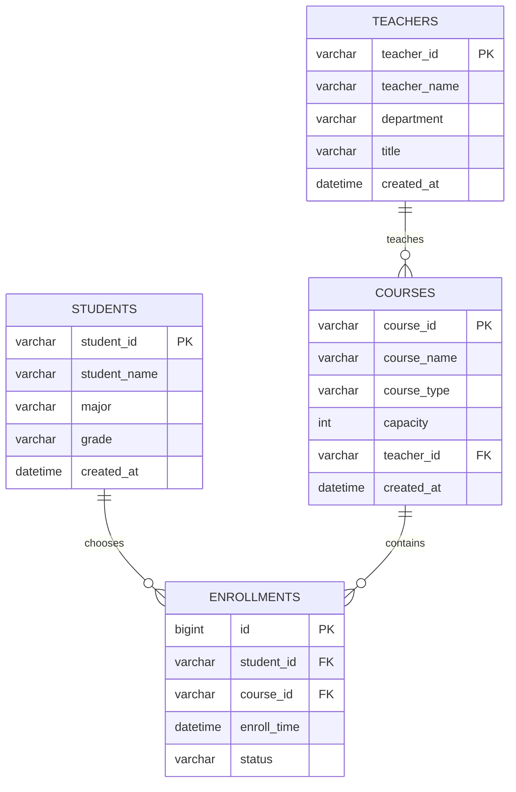

# 高校选课管理系统 - 学生选课基础处理工具

本项目是研发工程师 Vibe Coding 题目的考试演示版实现，基于 Spring Boot 3.x 完成学生选课数据的 CSV 批量导入、去重、排序、分类、检索和页面展示。

项目不接入数据库，选课数据暂存在内存中，重点满足题目要求的后端处理能力、前后端衔接和 Controller -> Service -> Entity 分层设计。

## 运行环境

- JDK 17+
- Maven 3.9+
- Spring Boot 3.3.5
- Thymeleaf

## 启动方式

```bash
mvn spring-boot:run
```

启动后访问：

```text
http://localhost:8080
```

## 功能说明

### 1. CSV 批量导入

页面提供文本框，支持输入多行 CSV 数据：

```text
S000001,C000001,Java程序设计,专业课
S000002,C000003,计算机网络,公共课
S000001,C000001,Java程序设计,专业课
S000003,C000005,创新创业实践,选修课
```

导入后系统会完成：

- 空行过滤
- 格式校验
- 选课记录封装
- 按学生 ID + 课程 ID 去重
- 按学生 ID、课程 ID 排序
- 按课程类型分类
- 页面回显

### 2. 去重规则

学生 ID + 课程 ID 完全一致时，视为重复记录。课程名称不参与去重判断。

系统保留第一条有效记录，移除后续重复记录。

### 3. 排序规则

先按学生 ID 升序排序，学生 ID 相同时按课程 ID 升序排序。

### 4. 课程分类

支持课程类型：

- 公共课
- 专业课
- 选修课

CSV 中提供课程类型时优先使用用户输入值；课程类型缺失或不合法时，根据课程名称自动识别。

### 5. 选课检索

支持按以下字段模糊检索：

- 学生 ID
- 课程 ID
- 课程名称
- 课程类型

检索不到时，页面提示：

```text
无匹配选课记录
```

## 接口设计

| 请求方式 | 路径 | 说明 |
| --- | --- | --- |
| GET | `/` | 打开首页，展示后台样例数据 |
| POST | `/enrollments/import` | 提交 CSV 文本，导入并回显处理结果 |
| GET | `/enrollments/search?keyword=xxx` | 按关键词检索选课记录 |

## 项目结构

```text
src/main/java/com/example/enrollment
├── EnrollmentApplication.java
├── controller
│   └── EnrollmentController.java
├── entity
│   └── EnrollRecord.java
└── service
    ├── EnrollmentService.java
    └── ImportResult.java

src/main/resources
├── application.properties
└── templates
    └── index.html
```

## SQL 编程题答案

### 题目 1：统计每门课程的选课人数

```sql
SELECT
    c.course_id,
    c.course_name,
    COUNT(e.student_id) AS enroll_count
FROM courses c
LEFT JOIN enrollments e ON c.course_id = e.course_id
GROUP BY c.course_id, c.course_name
ORDER BY enroll_count DESC;
```

说明：使用 `LEFT JOIN` 可以保留暂无学生选择的课程，选课人数显示为 0。

### 题目 2：统计选课人数超过 50 人的专业课

```sql
SELECT
    c.course_id,
    c.course_name,
    COUNT(e.student_id) AS enroll_count
FROM courses c
JOIN enrollments e ON c.course_id = e.course_id
WHERE c.course_type = '专业课'
GROUP BY c.course_id, c.course_name
HAVING COUNT(e.student_id) > 50
ORDER BY enroll_count ASC;
```

## AI 编程工具及完整提示词

使用的 AI 编程工具名称：

```text
ChatGPT / Codex
```

给 AI 的完整提示词：

```text
请基于 Spring Boot 3.x 和 Java 17 开发一个“高校选课管理系统 - 学生选课基础处理工具”的考试演示项目。

要求严格遵循 Controller -> Service -> Entity 分层设计，业务逻辑不能写在 Controller 中。

后端功能：
1. 定义 EnrollRecord 实体类，字段包含 studentId、courseId、courseName、courseType。
2. 支持 CSV 批量导入，CSV 每行格式为：学生ID,课程ID,课程名称,课程类型。
3. 支持单次不少于 500 条记录批量导入。
4. 导入后按 studentId + courseId 去重，课程名称不参与去重判断，重复记录直接移除。
5. 导入后按 studentId 升序、courseId 升序排序。
6. 支持按课程类型分类，包括公共课、专业课、选修课，课程类型可由用户手动标注；未标注或不合法时根据课程名称自动识别。
7. 支持按学生ID、课程ID、课程名称、课程类型四种关键词模糊检索。
8. 检索不到时提示“无匹配选课记录”。
9. 1000 条以上数据检索和排序响应时间不超过 1 秒。

页面要求：
1. 使用 Thymeleaf 或原生 HTML，不引入复杂前端框架。
2. 只设计一个简单页面。
3. 页面包含 CSV 文本框，用户可输入多行选课数据。
4. 页面包含导入按钮，点击后提交到 Spring Boot 后端。
5. 页面包含检索输入框和检索按钮。
6. 页面展示后端处理后的选课数据，字段包含学生ID、课程ID、课程名称、课程类型。
7. 页面加载时展示后台写死的样例选课数据。
8. 前端上传的数据必须提交到后端，经去重、排序、分类处理后再回显到页面。

请生成完整项目代码，包括 pom.xml、启动类、Controller、Service、实体类、Thymeleaf 页面、必要配置和测试代码。
```

## AI 生成与个人修改说明

### AI 生成部分

- Spring Boot 项目结构
- `EnrollRecord` 实体类
- `EnrollmentService` 中的 CSV 解析、去重、排序、分类、检索基础逻辑
- `EnrollmentController` 页面请求处理
- `index.html` 页面基础结构
- 单元测试
- README 文档初版

### 自己修改优化部分

- 增加 CSV 空行过滤和字段数量校验，避免异常输入导致程序报错。
- 增加课程类型兜底识别逻辑，适配课程类型缺失或输入不规范的情况。
- 使用 `LinkedHashMap` 按 `studentId + courseId` 去重，保留第一条有效记录，符合题目语义。
- 使用统一 Comparator 排序，保证导入、展示、检索结果顺序一致。
- 增加导入统计信息，展示输入行数、有效记录数、去重数量。
- 增加按课程类型分组展示区域，强化分类功能的页面体现。
- 增加单元测试验证去重、排序、检索四类字段匹配。

修改原因：适配高校选课数据处理场景，提升页面交互清晰度，完善前后端衔接，并保证考试演示时功能稳定可验证。

## 核心数据模型设计

正式系统可扩展为以下核心表，本考试演示版暂不落库。

### students 学生表

| 字段 | 类型 | 说明 |
| --- | --- | --- |
| student_id | VARCHAR(20) | 学生 ID，主键 |
| student_name | VARCHAR(50) | 学生姓名 |
| major | VARCHAR(50) | 专业 |
| grade | VARCHAR(20) | 年级 |
| created_at | DATETIME | 创建时间 |

### teachers 教师表

| 字段 | 类型 | 说明 |
| --- | --- | --- |
| teacher_id | VARCHAR(20) | 教师 ID，主键 |
| teacher_name | VARCHAR(50) | 教师姓名 |
| department | VARCHAR(50) | 所属院系 |
| title | VARCHAR(50) | 职称 |
| created_at | DATETIME | 创建时间 |

### courses 课程表

| 字段 | 类型 | 说明 |
| --- | --- | --- |
| course_id | VARCHAR(20) | 课程 ID，主键 |
| course_name | VARCHAR(50) | 课程名称 |
| course_type | VARCHAR(20) | 课程类型 |
| capacity | INT | 课程容量 |
| teacher_id | VARCHAR(20) | 主讲教师 ID |
| created_at | DATETIME | 创建时间 |

### enrollments 选课记录表

| 字段 | 类型 | 说明 |
| --- | --- | --- |
| id | BIGINT | 选课记录 ID，主键 |
| student_id | VARCHAR(20) | 学生 ID，外键 |
| course_id | VARCHAR(20) | 课程 ID，外键 |
| enroll_time | DATETIME | 选课时间 |
| status | VARCHAR(20) | 选课状态 |

## ER 图



## 并发风险分析

选课高峰期的核心并发问题是课程超选。

例如课程容量为 50，当前已有 49 人选课。如果多个学生同时提交选课请求，多个请求都可能读到当前人数为 49，并同时判断可以选课，最终导致实际选课人数超过容量。

简单可行的解决方案：

1. 使用数据库事务包裹选课流程。
2. 查询课程记录时使用行级锁，例如 `SELECT ... FOR UPDATE`。
3. 在事务内统计当前课程选课人数。
4. 当前人数小于容量时才插入选课记录。
5. 给 `student_id + course_id` 建唯一索引，防止同一学生重复选同一门课。

本考试演示版不接入数据库，因此不实现真实并发选课控制，只在设计说明中给出正式系统方案。

## 索引设计

### enrollments 表

```sql
CREATE UNIQUE INDEX uk_enrollment_student_course
ON enrollments(student_id, course_id);
```

理由：防止同一学生重复选择同一课程，同时加速按学生和课程组合查询。

```sql
CREATE INDEX idx_enrollment_course_id
ON enrollments(course_id);
```

理由：加速按课程统计选课人数，支持课程维度聚合。

```sql
CREATE INDEX idx_enrollment_student_id
ON enrollments(student_id);
```

理由：加速查询某个学生的全部选课记录。

### courses 表

```sql
CREATE INDEX idx_course_type
ON courses(course_type);
```

理由：加速按课程类型筛选，例如查询专业课。

```sql
CREATE INDEX idx_course_teacher_id
ON courses(teacher_id);
```

理由：加速查询某位教师教授的课程列表。

## 可行性分析

本项目采用考试演示版方案，不使用 PostgreSQL 或 MySQL。原因如下：

- 题目编程实战部分重点是 CSV 导入、去重、排序、分类、检索和页面展示，没有强制要求落库。
- 500 到 1000 条数据规模较小，Java 内存集合可以轻松满足 1 秒内处理要求。
- 不接入数据库可以减少建表、连接配置、初始化脚本等额外工作，降低考试交付风险。
- 使用内存 `List` 和 `LinkedHashMap` 能更直观展示核心业务逻辑。

因此，本项目作为考试演示版具备较高可行性。若后续升级为正式系统，可扩展 PostgreSQL、JPA/MyBatis、数据库事务和行级锁。

## 测试

运行单元测试：

```bash
mvn test
```

测试覆盖：

- CSV 导入
- 去重
- 排序
- 学生 ID 检索
- 课程 ID 检索
- 课程名称检索
- 课程类型检索
