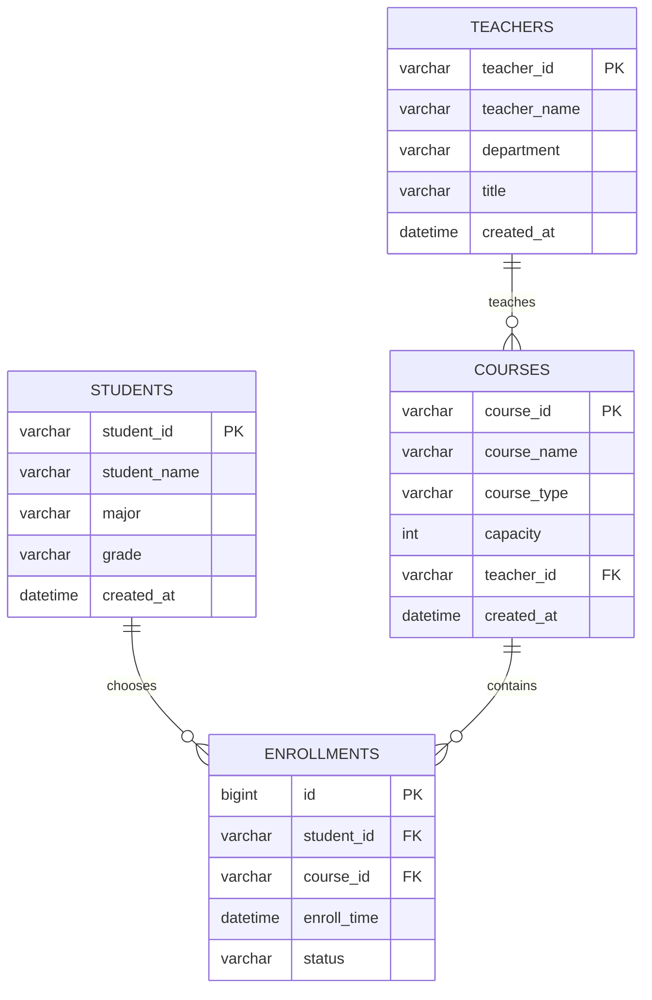

# 高校选课管理系统 - 学生选课基础处理工具

本项目是研发工程师 Vibe Coding 题目的考试演示版实现，基于 Spring Boot 3.x 完成学生选课数据的 CSV 批量导入、去重、排序、分类、检索和页面展示。

项目不接入数据库，选课数据暂存在内存中。核心目标是清晰展示 Controller -> Service -> Entity 分层、前后端衔接、集合处理能力和基础系统设计能力。

## 运行环境

- JDK 17+
- Maven 3.9+
- Spring Boot 3.3.5
- Thymeleaf

## 启动方式

```bash
mvn spring-boot:run
```

启动后访问：

```text
http://localhost:8080
```

## 关键边界说明

### 1. 多次导入策略

页面导入采用 **覆盖全量** 策略。

也就是说，每次提交 `POST /enrollments/import` 后，系统会用本次 CSV 中的有效记录替换内存中的全部选课记录。

如果本次 CSV 为空或没有任何有效记录，系统只返回错误提示，不覆盖已有数据。用户需要清空数据时，应点击“清空数据”按钮或调用清空接口。

选择覆盖策略的原因：

- 考试演示版不接数据库，数据只是内存态。
- 覆盖策略能避免多次导入后数据无限增长。
- 去重、排序、分类和检索的结果边界更清晰。
- 页面提供“重置样例”和“清空数据”按钮，方便恢复演示状态。

跨批次重复处理规则：

- 因为页面导入是覆盖全量，所以不存在跨批次合并去重。
- 每次导入只对本次 CSV 的有效记录执行 `studentId + courseId` 去重。
- 若后续扩展为追加导入，应改为“已有数据 + 本次数据”统一去重，并明确保留旧记录还是新记录。

### 2. 数据规模和性能口径

本演示版的性能目标限定为：

```text
单次 CSV 导入：500 条及以上
排序和检索数据量：1000 ~ 5000 条
响应时间：服务端处理时间 <= 1 秒
```

说明：

- 响应时间指 Service 层完成解析、去重、排序、检索的服务端处理时间。
- 不包含浏览器页面渲染时间、网络传输时间和首次 Maven 依赖下载时间。
- 超过 5000 条时，建议启用数据库分页、索引和持久化存储。

### 3. 排序和分组顺序

全量表格按以下规则排序：

1. 学生 ID 升序
2. 学生 ID 相同时按课程 ID 升序

分类分组展示时：

1. 分组顺序固定为：公共课、专业课、选修课
2. 每个分组内部仍按学生 ID、课程 ID 升序展示

### 4. CSV 格式规则

CSV 每行格式：

```text
学生ID,课程ID,课程名称,课程类型
```

课程类型可省略，省略时系统会按课程名称自动识别。

课程名称如果包含英文逗号，需要使用双引号包裹：

```text
S000001,C000001,"计算机科学导论,A班",专业课
```

双引号内部若需要表示双引号本身，使用两个双引号转义。

### 5. ID 校验规则

学生 ID 必须满足：

```text
S+6位数字，例如 S000001
```

课程 ID 必须满足：

```text
C+6位数字，例如 C000001
```

格式不合法的行会被跳过，并在页面错误列表中提示。

### 6. 检索规则

检索使用 `contains` 子串匹配，不区分英文字母大小写。

检索范围包括：

- 学生 ID
- 课程 ID
- 课程名称
- 课程类型

匹配结果不做字段优先级排序，统一按学生 ID、课程 ID 升序返回。

### 7. 课程类型识别规则

优先级：

1. CSV 中手动传入合法课程类型：公共课、专业课、选修课
2. 课程类型为空或不合法时，按课程名称关键词自动识别
3. 未命中关键词时归为选修课

专业课关键词示例：

```text
Java、Python、C++、程序设计、数据结构、算法、数据库、MySQL、NoSQL、计算机、网络、TCP/IP、软件工程、操作系统
```

公共课关键词示例：

```text
英语、思想政治、体育、高等数学、大学语文、马克思、毛概
```

若课程名同时命中专业课和公共课关键词，专业课优先。

## 功能说明

### 1. CSV 批量导入

示例：

```text
S000001,C000001,Java程序设计,专业课
S000002,C000003,计算机网络,公共课
S000001,C000001,Java程序设计,专业课
S000003,C000005,创新创业实践,选修课
```

导入后系统会完成：

- 空行过滤
- CSV 字段解析
- ID 格式校验
- 选课记录封装
- 按学生 ID + 课程 ID 去重
- 按学生 ID、课程 ID 排序
- 按课程类型分类
- 页面回显

### 2. 去重规则

学生 ID + 课程 ID 完全一致时，视为重复记录。课程名称不参与去重判断。

系统保留第一条有效记录，移除后续重复记录。

### 3. 页面展示

页面包含：

- CSV 批量导入文本框
- 导入数据按钮
- 重置样例按钮
- 清空数据按钮
- 选课检索输入框
- 结果表格
- 课程类型分组卡片
- 错误提示列表

## 接口设计

### 页面接口

| 请求方式 | 路径 | 说明 |
| --- | --- | --- |
| GET | `/` | 重置并展示后台样例数据 |
| POST | `/enrollments/import` | 提交 CSV 文本，覆盖全量内存数据并回显处理结果 |
| POST | `/enrollments/clear` | 清空内存中的选课记录 |
| GET | `/enrollments/search?keyword=xxx` | 按关键词检索选课记录并返回页面 |

### JSON API

为降低后续前后端分离改造成本，项目额外提供 JSON 接口。

| 请求方式 | 路径 | 说明 |
| --- | --- | --- |
| GET | `/api/enrollments?page=1&size=20` | 分页获取选课记录 |
| POST | `/api/enrollments/import` | 提交 CSV 文本，返回导入结果 JSON |
| POST | `/api/enrollments/clear` | 清空选课记录 |
| GET | `/api/enrollments/search?keyword=专业课&page=1&size=20` | 分页检索选课记录 |

分页说明：

- 默认 `page=1`
- 默认 `size=20`
- 最大 `size=100`
- Thymeleaf 页面演示版暂不做分页控件，JSON API 已保留分页能力

## 错误处理矩阵

| 场景 | 当前处理方式 |
| --- | --- |
| CSV 完全为空 | 返回错误提示“CSV内容为空，请至少输入一条选课记录”，不覆盖已有数据 |
| CSV 没有任何有效记录 | 返回错误提示，不覆盖已有数据 |
| 空行 | 自动忽略 |
| CSV 引号未闭合 | 跳过该行，并提示“CSV引号未闭合” |
| 字段数不是 3 或 4 | 跳过该行，并提示格式错误 |
| 学生 ID 为空 | 跳过该行，并提示必填字段为空 |
| 课程 ID 为空 | 跳过该行，并提示必填字段为空 |
| 课程名称为空 | 跳过该行，并提示必填字段为空 |
| 学生 ID 不符合 `S+6位数字` | 跳过该行，并提示学生 ID 格式错误 |
| 课程 ID 不符合 `C+6位数字` | 跳过该行，并提示课程 ID 格式错误 |
| 课程类型为空 | 自动识别课程类型 |
| 课程类型不合法 | 自动识别课程类型 |
| 行内重复记录 | 按 `studentId + courseId` 去重，保留第一条 |
| 检索无结果 | 页面显示“无匹配选课记录” |

## 项目结构

```text
src/main/java/com/example/enrollment
├── EnrollmentApplication.java
├── controller
│   ├── EnrollmentApiController.java
│   └── EnrollmentController.java
├── entity
│   └── EnrollRecord.java
└── service
    ├── EnrollmentService.java
    ├── ImportResult.java
    └── PagedResult.java

src/main/resources
├── application.properties
└── templates
    └── index.html
```

## 反馈问题落实表

| 编号 | 问题 | 当前体现 |
| --- | --- | --- |
| 1 | 多次导入追加还是替换 | 已明确为覆盖全量，见 `EnrollmentService#importFromCsv` |
| 2 | CSV 内部重复 vs 跨批次重复 | 当前只处理本批次重复，跨批次因覆盖策略不存在 |
| 3 | 1000 条以上无上限 | 已限定为 1000 ~ 5000 条服务端处理时间 <= 1 秒 |
| 4 | 分组后排序不清 | 已明确分组顺序固定，组内仍按学生 ID、课程 ID 排序 |
| 5 | 检索缺少分页 | JSON API 已提供分页；页面演示版暂不做分页控件 |
| 6 | 页面接口耦合 | 保留 Thymeleaf 页面接口，同时新增 JSON API |
| 7 | 缺少清空/重置 | 已有 `/` 重置样例，新增 `/enrollments/clear` 和 `/api/enrollments/clear` |
| 8 | 课程类型关键词不足 | 已扩充关键词，并明确专业课优先 |
| 9 | CSV 字段内逗号 | 已支持双引号包裹字段 |
| 10 | 模糊匹配不清 | 已明确为 contains 子串匹配，统一按排序规则返回 |
| 11 | 不校验 ID 格式 | 已校验 `S\\d{6}` 和 `C\\d{6}` |
| 12 | 错误处理说明缺失 | 已补错误处理矩阵 |
| 13 | 性能指标缺少基准 | 已补测量口径和数据范围 |
| 14 | 并发风险说明 | README 保留并发风险分析 |
| 15 | PRD 中可行性措辞 | README 将可行性放到技术说明语境，不作为产品需求自评 |

## SQL 编程题答案

### 题目 1：统计每门课程的选课人数

```sql
SELECT
    c.course_id,
    c.course_name,
    COUNT(e.student_id) AS enroll_count
FROM courses c
LEFT JOIN enrollments e ON c.course_id = e.course_id
GROUP BY c.course_id, c.course_name
ORDER BY enroll_count DESC;
```

说明：使用 `LEFT JOIN` 可以保留暂无学生选择的课程，选课人数显示为 0。

### 题目 2：统计选课人数超过 50 人的专业课

```sql
SELECT
    c.course_id,
    c.course_name,
    COUNT(e.student_id) AS enroll_count
FROM courses c
JOIN enrollments e ON c.course_id = e.course_id
WHERE c.course_type = '专业课'
GROUP BY c.course_id, c.course_name
HAVING COUNT(e.student_id) > 50
ORDER BY enroll_count ASC;
```

## AI 编程工具及完整提示词

使用的 AI 编程工具名称：

```text
ChatGPT / Codex
```

给 AI 的完整提示词：

```text
请基于 Spring Boot 3.x 和 Java 17 开发一个“高校选课管理系统 - 学生选课基础处理工具”的考试演示项目。

要求严格遵循 Controller -> Service -> Entity 分层设计，业务逻辑不能写在 Controller 中。

后端功能：
1. 定义 EnrollRecord 实体类，字段包含 studentId、courseId、courseName、courseType。
2. 支持 CSV 批量导入，CSV 每行格式为：学生ID,课程ID,课程名称,课程类型。
3. 页面导入采用覆盖全量策略，每次导入用本次有效数据替换内存中的全部记录。
4. 支持单次不少于 500 条记录批量导入。
5. 导入后按 studentId + courseId 去重，课程名称不参与去重判断，重复记录直接移除。
6. 导入后按 studentId 升序、courseId 升序排序。
7. 支持按课程类型分类，包括公共课、专业课、选修课，课程类型可由用户手动标注；未标注或不合法时根据课程名称自动识别。
8. 支持按学生ID、课程ID、课程名称、课程类型四种关键词模糊检索。
9. 检索不到时提示“无匹配选课记录”。
10. 支持学生 ID 和课程 ID 格式校验。
11. 支持 CSV 双引号字段，课程名称中可以包含英文逗号。
12. 提供 JSON API，并为列表和检索接口提供分页参数。
13. 1000~5000 条数据检索和排序服务端处理时间不超过 1 秒。

页面要求：
1. 使用 Thymeleaf 或原生 HTML，不引入复杂前端框架。
2. 只设计一个简单页面。
3. 页面包含 CSV 文本框，用户可输入多行选课数据。
4. 页面包含导入按钮，点击后提交到 Spring Boot 后端。
5. 页面包含重置样例和清空数据按钮。
6. 页面包含检索输入框和检索按钮。
7. 页面展示后端处理后的选课数据，字段包含学生ID、课程ID、课程名称、课程类型。
8. 页面加载时展示后台写死的样例选课数据。
9. 前端上传的数据必须提交到后端，经去重、排序、分类处理后再回显到页面。

请生成完整项目代码，包括 pom.xml、启动类、Controller、Service、实体类、Thymeleaf 页面、必要配置和测试代码。
```

## AI 生成与个人修改说明

### AI 生成部分

- Spring Boot 项目结构
- `EnrollRecord` 实体类
- `EnrollmentService` 中的 CSV 解析、去重、排序、分类、检索基础逻辑
- `EnrollmentController` 页面请求处理
- `index.html` 页面基础结构
- 单元测试
- README 文档初版

### 自己修改优化部分

- 明确导入采用覆盖全量策略，避免多批次数据边界不清。
- 空 CSV 或全错 CSV 不覆盖已有数据，避免误操作导致数据丢失。
- 内存记录使用原子引用整体替换，避免并发请求读到 `clear + addAll` 中间状态。
- 增加 CSV 双引号解析，支持课程名称中包含英文逗号。
- 增加学生 ID、课程 ID 格式校验。
- 增加清空数据接口和页面按钮。
- 增加 JSON API 和分页结果对象，降低后续前后端分离改造成本。
- 扩充课程类型自动识别关键词，并明确匹配优先级。
- 补充错误处理矩阵、性能测量口径和反馈问题落实表。

## 核心数据模型设计

正式系统可扩展为以下核心表，本考试演示版暂不落库。

### students 学生表

| 字段 | 类型 | 说明 |
| --- | --- | --- |
| student_id | VARCHAR(20) | 学生 ID，主键 |
| student_name | VARCHAR(50) | 学生姓名 |
| major | VARCHAR(50) | 专业 |
| grade | VARCHAR(20) | 年级 |
| created_at | DATETIME | 创建时间 |

### teachers 教师表

| 字段 | 类型 | 说明 |
| --- | --- | --- |
| teacher_id | VARCHAR(20) | 教师 ID，主键 |
| teacher_name | VARCHAR(50) | 教师姓名 |
| department | VARCHAR(50) | 所属院系 |
| title | VARCHAR(50) | 职称 |
| created_at | DATETIME | 创建时间 |

### courses 课程表

| 字段 | 类型 | 说明 |
| --- | --- | --- |
| course_id | VARCHAR(20) | 课程 ID，主键 |
| course_name | VARCHAR(50) | 课程名称 |
| course_type | VARCHAR(20) | 课程类型 |
| capacity | INT | 课程容量 |
| teacher_id | VARCHAR(20) | 主讲教师 ID |
| created_at | DATETIME | 创建时间 |

### enrollments 选课记录表

| 字段 | 类型 | 说明 |
| --- | --- | --- |
| id | BIGINT | 选课记录 ID，主键 |
| student_id | VARCHAR(20) | 学生 ID，外键 |
| course_id | VARCHAR(20) | 课程 ID，外键 |
| enroll_time | DATETIME | 选课时间 |
| status | VARCHAR(20) | 选课状态 |

## ER 图



## 并发风险分析

本考试演示版是内存态单应用演示，没有真实课程容量扣减，也没有多用户数据库写入，因此不会实现正式选课场景的并发控制。

如果升级为正式系统，选课高峰期的核心并发问题是课程超选。

例如课程容量为 50，当前已有 49 人选课。多个学生同时提交选课请求时，多个请求都可能读到当前人数为 49，并同时判断可以选课，最终导致实际选课人数超过容量。

简单可行的解决方案：

1. 使用数据库事务包裹选课流程。
2. 查询课程记录时使用行级锁，例如 `SELECT ... FOR UPDATE`。
3. 在事务内统计当前课程选课人数。
4. 当前人数小于容量时才插入选课记录。
5. 给 `student_id + course_id` 建唯一索引，防止同一学生重复选同一门课。

## 索引设计

### enrollments 表

```sql
CREATE UNIQUE INDEX uk_enrollment_student_course
ON enrollments(student_id, course_id);
```

理由：防止同一学生重复选择同一课程，同时加速按学生和课程组合查询。

```sql
CREATE INDEX idx_enrollment_course_id
ON enrollments(course_id);
```

理由：加速按课程统计选课人数，支持课程维度聚合。

```sql
CREATE INDEX idx_enrollment_student_id
ON enrollments(student_id);
```

理由：加速查询某个学生的全部选课记录。

### courses 表

```sql
CREATE INDEX idx_course_type
ON courses(course_type);
```

理由：加速按课程类型筛选，例如查询专业课。

```sql
CREATE INDEX idx_course_teacher_id
ON courses(teacher_id);
```

理由：加速查询某位教师教授的课程列表。

## 技术可行性说明

本项目采用考试演示版方案，不使用 PostgreSQL 或 MySQL。原因如下：

- 题目编程实战部分重点是 CSV 导入、去重、排序、分类、检索和页面展示，没有强制要求落库。
- 500 到 5000 条数据规模下，Java 内存集合足以满足服务端 1 秒内处理目标。
- 不接入数据库可以减少建表、连接配置、初始化脚本等额外工作，降低考试交付风险。
- 使用内存 `List` 和 `LinkedHashMap` 能更直观展示核心业务逻辑。

若后续升级为正式系统，可扩展 PostgreSQL、JPA/MyBatis、数据库事务、行级锁和数据库索引。

## 测试

运行单元测试：

```bash
mvn test
```

测试覆盖：

- CSV 导入
- 去重
- 排序
- 学生 ID 检索
- 课程 ID 检索
- 课程名称检索
- 课程类型检索
- ID 格式校验
- CSV 双引号字段解析
- JSON API 分页所需的分页结果逻辑
